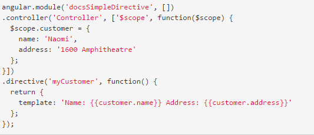
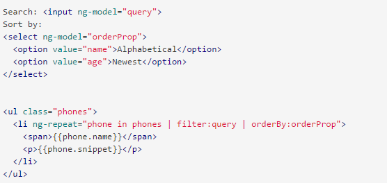

# Angular.js in simple words


<!-- # Video

  <video data-autoplay>
    <source data-src="https://s3.amazonaws.com/static.slid.es/site/homepage/v1/homepage-video-editor.mp4" type="video/mp4" />
  </video>

-->
# Customize

Transition Styles: [None](?transition=none#/transitions) -
[Slide](?transition=slide#/transitions) -
[Convex](?transition=convex#/transitions) -
[Concave](?transition=concave#/transitions) -
[Zoom](?transition=zoom#/transitions)

Themes: <a href="#" onclick="document.getElementById('theme').setAttribute('href','node_modules/reveal.js/css/theme/black.css'); return false;">Black (default)</a> -
<a href="#" onclick="document.getElementById('theme').setAttribute('href','node_modules/reveal.js/css/theme/white.css'); return false;">White</a> -
<a href="#" onclick="document.getElementById('theme').setAttribute('href','node_modules/reveal.js/css/theme/league.css'); return false;">League</a> -
<a href="#" onclick="document.getElementById('theme').setAttribute('href','node_modules/reveal.js/css/theme/sky.css'); return false;">Sky</a> -
<a href="#" onclick="document.getElementById('theme').setAttribute('href','node_modules/reveal.js/css/theme/beige.css'); return false;">Beige</a> -
<a href="#" onclick="document.getElementById('theme').setAttribute('href','node_modules/reveal.js/css/theme/simple.css'); return false;">Simple</a> <br>
<a href="#" onclick="document.getElementById('theme').setAttribute('href','node_modules/reveal.js/css/theme/serif.css'); return false;">Serif</a> -
<a href="#" onclick="document.getElementById('theme').setAttribute('href','node_modules/reveal.js/css/theme/blood.css'); return false;">Blood</a> -
<a href="#" onclick="document.getElementById('theme').setAttribute('href','node_modules/reveal.js/css/theme/night.css'); return false;">Night</a> -
<a href="#" onclick="document.getElementById('theme').setAttribute('href','node_modules/reveal.js/css/theme/moon.css'); return false;">Moon</a> -
<a href="#" onclick="document.getElementById('theme').setAttribute('href','node_modules/reveal.js/css/theme/solarized.css'); return false;">Solarized</a>

Highlight: <a href="#" onclick="document.getElementById('highlight').setAttribute('href','node_modules/reveal.js/lib/css/zenburn.css'); return false;">Zenburn</a> -
<a href="#" onclick="document.getElementById('highlight').setAttribute('href','node_modules/base16-oceanic-next/highlight.js/base16-oceanicnext.dark.css'); return false;">Oceanic Next (default)</a> -
<a href="#" onclick="document.getElementById('highlight').setAttribute('href','node_modules/highlight.js/src/styles/default.css'); return false;">default</a> -
<a href="#" onclick="document.getElementById('highlight').setAttribute('href','node_modules/highlight.js/src/styles/github.css'); return false;">github (default)</a>

[Print](?print-pdf)


# HTML tags

Angular is a way to add new html tags


# Example

```html
<html ng-app="phonecatApp">
<head>
  <script src="bower_components/angular/angular.js"></script>
  <script src="js/controllers.js"></script>
</head>
<body ng-controller="PhoneListCtrl">

  <ul>
    <li ng-repeat="phone in phones">
      <span>{{phone.name}}</span>
      <p>{{phone.snippet}}</p>
    </li>
  </ul>

</body>
</html>
```


# Tags are declarative

You specify what you want not how to do it


# Cons?


# if and loop in templates :(

- ng-if
- ng-repeat


# Simple example

index.html
```html
<!doctype html>
<div ng-app>
  <ul>
    <li ng-repeat="1 in 1..10">
      <span ng-if="$index % 2 === 0">even</span>
    </li>
  </ul>
</div>
<script src="angular.js"></script>
<script src="app.js"></script>
```


# Directives




# I want my javascript back!

app.js
```javascript
angular.module('myApp', []).
controller('myController', function() {
  console.log('Hello console');
});
```


# Services

- Lazily instantiated
- Singletons


# Types kinds of services

- provider - just needs to return a function called $get which is what we inject on the other components
- factory - receives a function that gets called when we create it
- service - receives a constructor function where we do a new on it (actually internally is uses Object.create instead of new)
- value

http://angular-tips.com/blog/2013/08/understanding-service-types/


# Provider

```javascript
app.provider('foo', function() {

  var thisIsPrivate = "Private";

  return {

    setPrivate: function(newVal) {
      thisIsPrivate = newVal;
    },

    $get: function() {
      function getPrivate() {
        return thisIsPrivate;
      }

      return {
        variable: "This is public",
        getPrivate: getPrivate
      };
    }

  };

});

app.config(function(fooProvider) {
  fooProvider.setPrivate('New value from config');
});
```


# factory

```javascript
app.factory('foo', function() {
  var thisIsPrivate = "Private";
  function getPrivate() {
    return thisIsPrivate;
  }

  return {
    variable: "This is public",
    getPrivate: getPrivate
  };
});

// or..

app.factory('bar', function(a) {
  return a * 2;
});
```


# Service

```javascript
app.service('foo', function() {
  var thisIsPrivate = "Private";
  this.variable = "This is public";
  this.getPrivate = function() {
    return thisIsPrivate;
  };
});
```


# Value

```javascript
app.constant('fooConfig', {
  config1: true,
  config2: "Default config2"
});
```


# Data Binding in Classical Template Systems


# Data Binding in Angular Templates


# Example




# ng-if and ng-repeat have their own scopes

```
$parent.sth
```


# Learn

- https://docs.angularjs.org/tutorial
- http://angular.codeschool.com/


# Style guide

https://github.com/johnpapa/angular-styleguide


# Questions?

